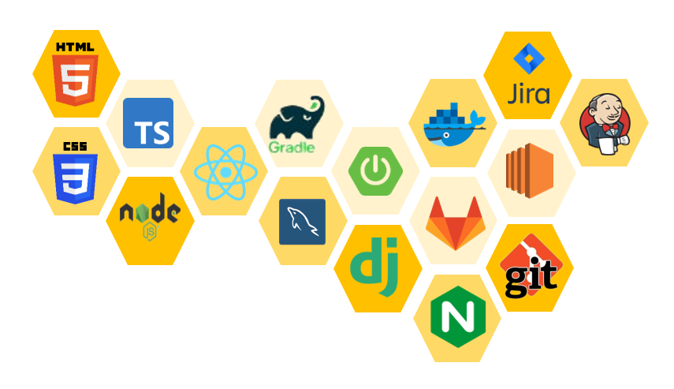
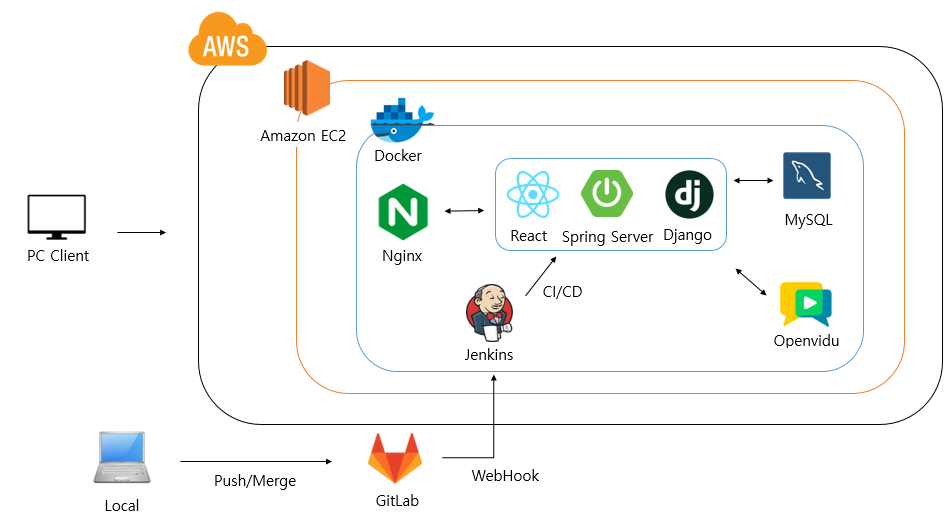

<br>

# AI 음성인식을 통한 보이스피싱 예방 프로젝트
<!-- # <center>🏃‍♂️ VoiceScout 🏃‍♀️</center> -->


- ### 프로젝트 개요

  - 🏠 [VoiceScout Homepage](https://j8a404.p.ssafy.io/)

  - `VoiceScout` 는 AI 음성인식을 통해 보이스피싱 여부를 판단하고 사용자에게 사전에 경고하여 보이스피싱 범죄를 예방하기 위한 웹서비스 입니다.  

- ### 주요 기능

  - **통화 체험 기능**

    > -  통화방을 생성하고 사기범, 피해자로 역할을 나누어 통화를 진행합니다.
    > -  보이스피싱 범죄 유형에 따라 대본이 주어집니다.
    > -  사기범의 음성데이터를 통해 보이스피싱 의심여부를 판단하고, 판단여부는 알림을 통해 확인할 수 있습니다 .

  - **O/X 퀴즈**

    > - O/X 퀴즈를 풀어보면서 실제 범죄사례들과 수법을 학습하고 예방할 수 있습니다. 
  - **범죄 수법 안내**

    > - 보이스피싱 범죄 수법유형, 실제 범인 문자, 에방법, 구제방법을 안내합니다. 

## 📌 목차

[🏃‍♂️ VoiceScout 🏃‍♀️](#VoiceScout)

- [시작하기](#-시작하기)
  - [시작하기에 앞서](#시작하기에-앞서)
  - [설치하기](#설치하기)
  - [실행하기](#실행하기)
  - [배포하기](#배포하기)
  - [데모](#데모)
- [지원하는 브라우저](#-지원하는-브라우저)
- [사용된 도구](#🛠️-사용된-도구)
- [사용된 기술](#🖥️-사용된-기술)
- [시스템 아키텍쳐](#🖥️-시스템-아키텍쳐)
<!-- - [시연연상](#시연연상) -->
- [서비스 소개](#📼-서비스-소개)
  - [1. 메인페이지](#1-메인페이지)
  - [2. 범죄수단 소개 및 예방 안내](#2-범죄수단-소개-및-예방-안내)
  - [3. 통화체험실](#3-통화체험실)
  - [4. O/X 퀴즈](#4-O/X-퀴즈)

- [저자](#-저자)

## 🏃 시작하기

아래 방법을 따르시면 프로젝트를 실행시킬 수 있습니다.

### 시작하기에 앞서

- [Windows 10](https://www.microsoft.com/en-us/software-download/windows10)
- [Zulu 11](https://www.azul.com/downloads-new/?package=jdk#zulu)
- [Node.js 12.8.1](https://nodejs.org/ko/download/)
- [MySQL 8.0](https://www.mysql.com/downloads/)

### 설치하기

1. 깃랩의 레포지토리를 클론합니다.

   ```
   $ git clone https://lab.ssafy.com/s08-ai-speech-sub2/S08P22A404.git
   ```

2. npm을 설치합니다.

   ```
   $ npm install
   ```

### 실행하기

`Voicescout` 서비스를 사용하기 위해서는 다음과 같은 방법으로 실행합니다:

1. 데이터베이스를 설정합니다.

   - [voicescout.sql](https://lab.ssafy.com/s08-ai-speech-sub2/S08P22A404/-/blob/dev/exec/Docs/voicescout.sql)을 참고해서 데이터베이스를 생성합니다. ([여기](https://lab.ssafy.com/s08-ai-speech-sub2/S08P22A404/-/blob/dev/exec/Docs/ERD.png)를 눌러 erd를 확인하세요.)

   - `application.properties`에 데이터베이스 설정을 추가합니다.

     ```
     spring:
       datasource:
         driver-class-name: com.mysql.cj.jdbc.Driver
         url : jdbc:mysql://localhost:3306/voicescout?characterEncoding=UTF-8&serverTimezone=Asia/Seoul
         username : {데이터베이스 계정 아이디}
         password : {데이터베이스 계정 비밀번호}
     ```

2. 백엔드 서버를 실행합니다.

   - IDE에 import 후 실행합니다.

     : IntelliJ, STS와 같은 IDE를 사용하는 경우, `Backend`를 import하여 실행합니다.

   - jar파일을 생성 후 실행합니다.

     ```
     $ gradlew build
     ```

     ```
     $ java -jar [filename].jar
     ```

3. 프론트엔드 모듈 설치 후 실행합니다.

```
	$ npm i (혹은 npm install)
	설치 오류 발생 시 $npm install --force 로 강제 설치
    $ npm start
```

### 배포하기

해당 서비스는 `AWS EC2`를 이용하여 배포하였습니다. 사전에 [여기](https://victorydntmd.tistory.com/61)를 참고해서 `AWS EC2`계정을 생성하세요.

배포를 하기위해서는 다음과 같은 방법으로 실행합니다:

1. AWS EC2 인스턴스 생성

2. Ubuntu 환경에 Git Clone

3. Nginx 환경 설정

```
   events {
    worker_connections  1024;
}


http {
    include       /etc/nginx/mime.types;

    upstream front {
        server front-app:9443;
    }

    upstream back {
        server back-app:4433;
    }

    server {
        listen 80;

        location /.well-known/acme-challenge/ {
                root /var/www/certbot;
        }

        location / {
                return 301 https://$host$request_uri;
        }
    }

    server {
        listen 443 ssl;
        server_name j8a404.p.ssafy.io;

        ssl_certificate /etc/letsencrypt/live/j8a404.p.ssafy.io/fullchain.pem;
        ssl_certificate_key /etc/letsencrypt/live/j8a404.p.ssafy.io/privkey.pem;

        location / {
                proxy_pass https://front;
        }

        location /api {
                proxy_pass https://back;
        }
    }
}
```

4. JDK 설치 (환경변수 설정)

5. DB 설치 (해당 프로젝트에서 MySQL 사용)

6. gradle wrapper을 위한 버전 설정 (6.0.0 이상)

7. gradle clean build 실행 (jar 파일 생성)

8. npm build (dist 폴더 생성)

### 데모

[여기](https://j8a404.p.ssafy.io/)를 클릭하세요.

## 🌐 지원하는 브라우저

|  |   |  |
| :-----------------------------------------------------------------------------------------------------------------------: | :-----------------------------------------------------------------------------------------------------------------------:  | :-----------------------------------------------------------------------------------------------------------------------: |
|                                                          latest                                                           |                                                          latest                                                           |                                                          latest                                                           |                                                          latest                                                           |

## 🛠️ 사용된 도구

- React 18.2.0
- Node 18.12.1 LTS
- Npm 8.19.2
- Spring boot 2.7.6
- Gradle 7.6
- Django 4.1.7
- IDE: Visual Studio Code 1.48, IntelliJ IDEA 2022.3.1

## 🖥️ 사용된 기술



**[ BACK END ]**

- **Spring Boot** : VociceScout Project의 전반적인 Rest Controller 구현..
- **JPA (Hibernate)** 
  - ORM인 Hibernate를 활용하여 객체 중심의 개발을 할 수 있도록 함 
  - SQL을 직접 작성하지 않고 Entity 필드가 되는 객체를 통해 DB를 동작시켜 유지보수에 용이하게 활용.
  - 동일한 쿼리에 대한 캐시 기능을 사용하기 때문에 높은 효율성 기대
- **JUint** 
  - Controller, Service, Repository 에 대해 Given-When-Then 구조로 독립적으로 테스트를 작성. 
- **SSL 프로토콜** : SSL을 적용하여 전송되는 패킷값을 암호화하여 외부의 공격자로부터 데이터를 보안하기 위해 사용.
  - **Let’s Encrypt** 무료 인증서를 발급받아 웹서버에 SSL 인증서를 적용.
- **MySql** : RDBMS로 VociceScout의 통화방 데이터를 저장.
- **Jenkins** : CI/CD를 위해 Gitlab과 연동하여 master branch에 merge 시 빌드 부터 배포까지 자동화.
- **Docker**
  - front, back, db, jenkins, nginx 기능별로 컨테이너를 각각 할당하여 관리 및 확장에 용이.
  - docker compose를 통해 컨테이너의 관리를 통합
- **AWS**
  - EC2 서비스를 이용하여 Ubuntu 서버를 구축 (호스팅).

- **Nginx** : 요청 uri를 분기하고, 웹 서버 및 리버스 프록시 서버를 구축
- **Openvidu** : openvidu에서 제공하는 docker container를 생성하고, WebRTC를 통해 통화방 기능 구현
- **WebSocket** : 웹 상에서 쉽게 소켓 통신을 하게 해주는 라이브러리를 활용하여 음성텍스트 송신, 보이스피싱 알림 기능을 구현.
- **Django** : 이진분류 AI모델을 통해 음성데이터를 이진분류하여 보이시피싱 의심여부를 반환
**[ FRONT END ]**

- **React** : 프로젝트 레이아웃 작성을 위한 front-end framework
  _ **React-redux** : 전역 클라이언트 state를 편리하게 관리하기 위한 통합 라이브러리
  _ **React-Router-Dom** : 최소한의 새로고침으로 SPA의 기능을 극대화하고 유저의 사용경험을 부드럽게 만들기 위해 사용되는 route관리 라이브러리 \* **Styled-Components** : 태그에 css를 부여할 때 사용되는 className의 경우 css 파일내에 변수 값을 사용할 수 없기 때문에 사용된 라이브러리.
  styled components를 사용해 조건에 따라 속성 값이 바뀌도록 설정
- **React-query** : 서버 state와 클라이언트 state를 분리하여 상태관리의 가독성을 높이고 다양한 캐싱, refetch 기능을 활용하여 효율적으로 서버 사이드 state를 효율적으로 관리하도록 유용한 기능을 제공.
- **Openvidu-browser** : 복잡한 webRTC기능을 캡슐화 하여서 최소한의 커스터마이징만으로 화상기능을 사용 할 수 있도록 라이브러리를 제공
- **websocket-Sockjs** : websocket 통신 기능을 제공하는 라이브러리. websocket을 지원하지 않는 브라우저에서도 websocket 통신 활성화. sockjs를 통해 websocket 연결
- **websocket-Stompjs** : websocket 통신 중 동일한 sessionId에 속한 user들 끼리만 통신을 할 수 있는 subscribe 방식을 제공.
  stomp를 통해 client object 생성 후 subscribe를 지정하여 특정 session에 message를 send하도록 설정 가능
- **SpeechRecognition** : Web Speech API로 브라우저에서 사용자의 음성을 인식해서 텍스트로 변환작업 수행.

**[ TEAM Cooperation ]**

- **GitLab** : GitLab을 활용하여 프로젝트를 관리.
  - GitHub Flow 에 따른 브랜치 전략 수립.
  - merge 시 코드 리뷰 진행.
- **Jira** : 이슈 관리 도구로 활용.
  - 주요 기능들을 이슈로 등록하고 Story Point를 산정한 후, 담당자를 지정하여 프로젝트를 진행.
  - 1주일 기준 40시간을 할당하여 본인의 계획을 구체적으로 설계.

## 🖥️ 시스템 아키텍쳐



<!-- ## 시연연상

- https://youtu.be/3vCORb1hAqs -->

## 📼 서비스 소개

### 1. 메인페이지

<!--  -->

- **[메인화면] :** 서비스 소개 및 이용가이드 안내에 대한 내용이 게시되어 있는 페이지다.

### 2. 범죄수단 소개 및 예방 안내

<!--  -->

- **[수법소개] :** 보이스피싱 범죄을 유형별로 구분하여 소개합니다.
- **[범인문자] :** 실제 사기범들이 피해자들에게 전송하는 문자를 유형별로 소개합니다.
- **[예방법] :** 보이스피싱 예방을 위한 '십계명'을 안내합니다.
- **[구제방법] :** 보이스피싱 피해를 당했을 때의 대처법을 안내합니다.


### 3. 통화체험실 

<!--  -->

- **[통화방 생성] :**  사기범, 피해자 역할을 정하고 범죄유형을 선택하여 방을 생성합니다. 범죄유형에 따라 대본이 주어지고, 통화방에서 나누는 대화는 STT API를 통해 서버로 전송됩니다. 
- **[보이스피싱 알림] :**  AI 이진분류 모델을 통해 보이스피싱 의심여부를 판단하고, 판단여부를 피해자에게 전달합니다. 

### 4. O/X 퀴즈

<!--  -->

- **[O/X 퀴즈] :** O/X 퀴즈를 풀어보면서 실제 범죄사례들과 수법을 학습하고 예방할 수 있습니다. 


## 👤 저자

- 김동연 - DongYeon Kim - eastflow815@gmail.com
- 김정수 - jumgsu Kim - kjskjs356@gmail.com
- 박금원 - Geumwon Park - gemong2@naver.com
- 박서영 - Seoyoung Park - manchott@naver.com
- 윤호산 - Hosan Yoon - yoonhosan@naver.com
- 조웅희 - Unghui Cho - paul9512@gmail.com

